# Kịch bản thuyết trình Lab 5 — slide 1 đến 13

Dành cho **Mai Trung Hậu**. Đây là **lời nói thật**, không phải gạch đầu dòng.

Mục tiêu của tài liệu này: đọc xong bạn **tự nói lại được bằng lời của mình**,
chứ không phải học thuộc.

- **13 slide · cộng dồn thời lượng từng slide là 17 phút 10**
- Mỗi slide có: ý chính, lời nói, chỉ vào đâu, và câu hỏi có thể bị vặn

> ⚠️ **ĐỌC MỤC "LỖI CẦN SỬA GẤP" Ở CUỐI TRƯỚC KHI IN SLIDE.** Code trên slide
> 6, 7, 8, 9, 10 đang bị hiển thị sai thứ tự — phải sửa trước khi trình bày.

---

## Một phép so sánh dùng xuyên suốt — học thuộc cái này thôi

Nếu bạn chỉ nhớ được một thứ trong cả bài, hãy nhớ cái này:

> **Kiến trúc trong Lab 5 giống hệt chuyện tuyển dụng trong công ty.**

| Trong công ty | Trong Lab 5 |
|---|---|
| **Bản mô tả công việc (JD)** — "cần người làm được X, Y, Z" | `IPostRepository` — hợp đồng |
| **Anh Nam** — người được tuyển, làm thật | `PostRepositoryImpl` |
| **Phòng ban** — chỉ cần việc được làm, không quan tâm ai làm | `PostProvider` |
| **Phòng nhân sự** — nơi duy nhất biết ai ngồi vị trí nào | `injection.dart` + GetIt |
| Anh Nam nghỉ → tuyển anh Bình, phòng ban **không đổi cách làm việc** | Đổi Data Source, `PostProvider` không sửa dòng nào |

Mọi slide bên dưới đều quy về phép so sánh này. Khi bí, quay về nó.

---

## Data Source là gì — phần nền, KHÔNG chiếu lên slide

Đọc phần này để **hiểu**, không phải để nói. Nó lấp một lỗ hổng trong mạch bài:
bốn flow đầu không hề nhắc tới Data Source, tới Flow 5 nó mới xuất hiện.

### Trước Flow 5, `PostRepositoryImpl` làm hai việc cùng lúc

Mở `lib/ex04/data/repositories/post_repository_impl.dart` ra xem. Trong một hàm
`getPosts()` có đúng hai loại công việc trộn vào nhau:

```dart
final db = await databaseHelper.getDatabase();
final rows = await db.query('posts', orderBy: 'id asc');   // ← việc 1: lấy dữ liệu

return rows.map((row) {
  final model = PostModel(...);                            // ← việc 2: dịch dữ liệu
  return model.toEntity();
}).toList();
```

| | Việc 1 | Việc 2 |
|---|---|---|
| Làm gì | Chạy câu lệnh, lấy dữ liệu thô về | Dịch dữ liệu thô sang `PostEntity` |
| Phải biết gì | SQLite, tên bảng `posts`, cột `is_like` | `PostModel`, `PostEntity`, quy tắc 1/0 ↔ true/false |
| Đổi khi nào | Khi **đổi nơi chứa dữ liệu** | Khi **đổi cách app hiểu dữ liệu** |

Hai việc này **thay đổi vì hai lý do khác nhau**. Đó là dấu hiệu kinh điển của
một class đang ôm quá nhiều việc.

### Flow 5 tách đôi chúng ra

```
TRƯỚC (Flow 4)                      SAU (Flow 5)

PostRepositoryImpl                  PostRepositoryImpl
  ├── chạy SQL                        └── chỉ dịch Map → Entity
  └── dịch Map → Entity                     ↓
        ↓                             IPostDataSource   ← hợp đồng thứ hai
   DatabaseHelper                           ↑
                                      PostDataSourceImpl
                                        └── chỉ chạy SQL
                                              ↓
                                        DatabaseHelper
```

Sau khi tách, mỗi bên chỉ còn một lý do để đổi:

```dart
// PostDataSourceImpl — chỉ lấy dữ liệu thô, KHÔNG dịch
Future<List<Map<String, dynamic>>> getPosts() async {
  final db = await databaseHelper.getDatabase();
  return db.query('posts', orderBy: 'id asc');
}
```

Để ý kiểu trả về: **`Map<String, dynamic>` — dữ liệu thô, y như SQLite trả ra.**
Data Source cố tình không dịch. Việc dịch là của Repository.

### Định nghĩa một câu cho mỗi cái

| Tên | Trả lời câu hỏi | Biết gì |
|---|---|---|
| `IPostRepository` | *App cần gì?* | chỉ biết `PostEntity` |
| `PostRepositoryImpl` | *Dịch dữ liệu thô sang thứ app hiểu* | biết `PostModel`, quy tắc 1/0 |
| `IPostDataSource` | *Lấy dữ liệu bằng cách nào?* | chỉ khai báo, không biết gì |
| `PostDataSourceImpl` | *Lấy từ SQLite* | biết SQL, tên bảng, tên cột |

### Vậy rốt cuộc được gì?

Được đúng **một** thứ, nhưng là thứ quan trọng nhất của cả Lab 5:
**`PostRepositoryImpl` không còn biết SQLite tồn tại.**

Mở file ex05 ra mà xem — nó **không import `DatabaseHelper`** nữa, chỉ import
`IPostDataSource`. Nhờ vậy mới có chuyện đổi nguồn dữ liệu bằng một dòng:

```dart
const bool useInMemoryDataSource = true;   // → InMemoryPostDataSource
```

`InMemoryPostDataSource` đọc dữ liệu từ một `List` trong RAM, không có SQLite,
không có câu SQL nào. Vậy mà `PostRepositoryImpl` không sửa một chữ — vì nó chỉ
làm việc với hợp đồng `IPostDataSource`.

> **Đây chính là cú lật ở slide 12.** Nếu không có Flow 5, cú lật đó không tồn
> tại: `PostRepositoryImpl` sẽ dính chặt vào `DatabaseHelper`, và muốn đổi nguồn
> thì phải sửa chính nó.

### Nếu chỉ nhớ được một câu

> **Data Source biết *lấy ở đâu*. Repository biết *dịch thành gì*.**

Quay về ví dụ tuyển dụng: `PostDataSourceImpl` là **nhân viên kho** — xuống kho
bê hàng lên, không quan tâm hàng dùng làm gì. `PostRepositoryImpl` là **nhân
viên xử lý** — nhận hàng thô, đóng gói thành thứ phòng ban dùng được.

---
---

# Slide 1 — Bìa

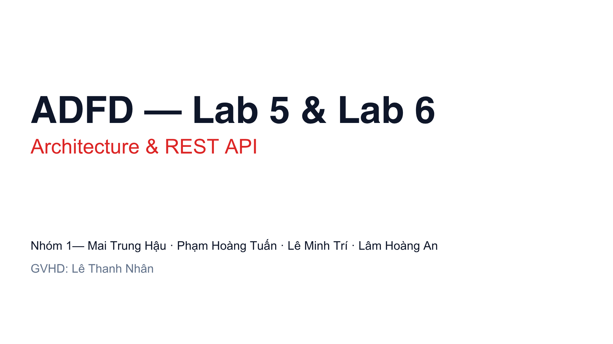

**Thời lượng:** ~20 giây
**Ý chính:** cho lớp biết bạn là ai và sắp nghe gì.

### Lời nói

> *"Chào thầy và các bạn. Nhóm em là nhóm 1, gồm bốn thành viên: em là Hậu, bạn
> Tuấn, bạn Trí và bạn An.*
>
> *Nhóm em được giao hai lab cuối cùng của môn: Lab 5 về Architecture và Lab 6 về
> REST API. Phần đầu tiên, về kiến trúc, sẽ do em trình bày."*

### Lưu ý
Đừng đọc lại tên từng người trên slide — slide đã ghi rồi. Nói ngắn, chuyển tiếp
nhanh.

---
---

# Slide 2 — Mục lục

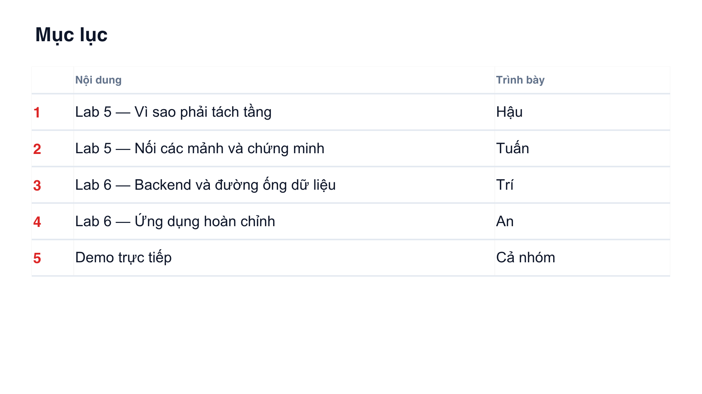

**Thời lượng:** ~30 giây
**Ý chính:** lớp biết bài dài bao lâu và đi qua những đâu.

### Lời nói

> *"Buổi hôm nay nhóm em chia làm năm phần. Hai phần đầu là Lab 5 — em và bạn
> Tuấn. Hai phần sau là Lab 6 — bạn Trí và bạn An. Cuối cùng cả nhóm sẽ demo hai
> sản phẩm chạy thật để mọi người thấy.*
>
> *Em bắt đầu với phần một: vì sao phải tách tầng."*

### Chỉ vào đâu
Lướt ngón tay từ dòng 1 xuống dòng 5 khi đọc, rồi dừng lại ở dòng 1.

---
---

# Slide 3 — Hai lab, hai câu hỏi

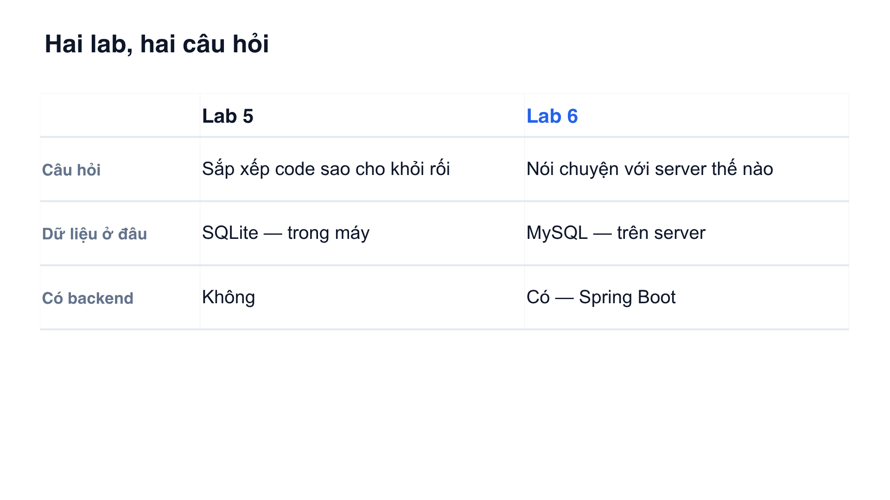

**Thời lượng:** ~70 giây
**Ý chính:** hai lab giải quyết **hai vấn đề khác nhau**, không phải hai phần của
một vấn đề.

### Lời nói

> *"Trước khi vào chi tiết, em muốn các bạn nắm một điều: Lab 5 và Lab 6 trả lời
> hai câu hỏi hoàn toàn khác nhau.*
>
> *Lab 5 hỏi: **sắp xếp code sao cho khỏi rối**. Dữ liệu nằm ngay trong máy điện
> thoại, dùng SQLite — giống như bài của nhóm làm Lab 2 đã trình bày. Không có
> server nào cả.*
>
> *Lab 6 thì khác hẳn: dữ liệu nằm trên **server thật**, dùng MySQL, và có hẳn
> một backend Spring Boot. Lab 6 hỏi: **làm sao để app nói chuyện được với
> server**.*
>
> *Tóm lại: Lab 5 khó ở chỗ **tư duy sắp xếp**, Lab 6 khó ở chỗ **vận hành nhiều
> thứ cùng lúc**. Phần em trình bày là Lab 5."*

### Chỉ vào đâu
Chỉ cột "Lab 5" khi nói về Lab 5, chỉ cột "Lab 6" khi nói Lab 6. Đừng đứng yên.

### Nếu bị hỏi
**"SQLite là gì?"** → *"Là một database nhỏ nằm ngay trong máy điện thoại, không
cần mạng. Nó lưu thành một file. Nhóm làm Lab 2 đã trình bày kỹ phần này rồi ạ."*

---
---

# Slide 4 — Câu hỏi mở đầu

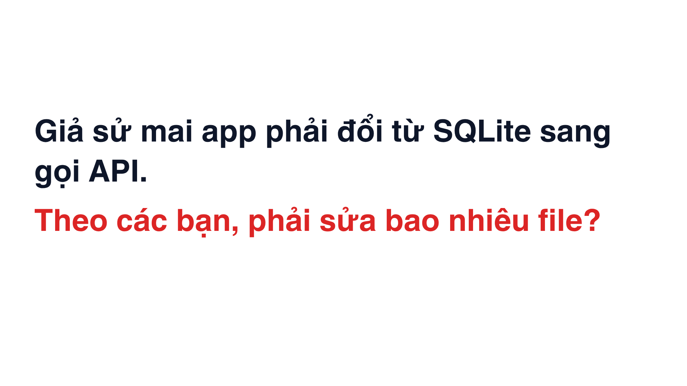

**Thời lượng:** ~60 giây
**Ý chính:** gieo một câu hỏi, **không trả lời**, để lớp mang theo suốt bài.

> Đây là slide quan trọng nhất về mặt dẫn dắt. Nếu làm tốt, cả lớp sẽ tò mò tới
> tận slide 12.

### Lời nói

> *"Trước khi em nói bất cứ điều gì về kiến trúc, em muốn đặt cho các bạn một câu
> hỏi.*
>
> *Giả sử chúng ta đang có một app đọc dữ liệu từ SQLite — tức là dữ liệu nằm
> trong máy. Chạy ngon lành. Rồi ngày mai công ty bảo: đổi đi, giờ dữ liệu nằm
> trên server, gọi API mà lấy.*
>
> *Theo các bạn, phải sửa bao nhiêu file?"*

**→ DỪNG LẠI. Đếm thầm ba giây. Nhìn xuống lớp.**

> *"Các bạn cứ giữ con số đó trong đầu. Cuối phần trình bày của nhóm em, chúng
> ta sẽ biết con số thật là bao nhiêu."*

### Lưu ý quan trọng
**Đừng trả lời câu hỏi này.** Cũng đừng nói "câu trả lời là một dòng" ở đây.
Toàn bộ sức mạnh của slide 12 nằm ở chỗ lớp phải chờ.

Nếu có bạn nào buột miệng đoán — cứ cười và nói *"lát nữa mình sẽ biết"*.

---
---

# Slide 5 — Bản đồ ba tầng

> 🆕 **SLIDE MỚI — chưa có trong file pptx hiện tại.** Phải thêm vào Canva ở giữa
> slide 4 và slide 5 cũ, rồi export lại toàn bộ PNG. Sau khi export xong, đổi ảnh
> bên dưới thành `assets/slides/slide-05.png`.

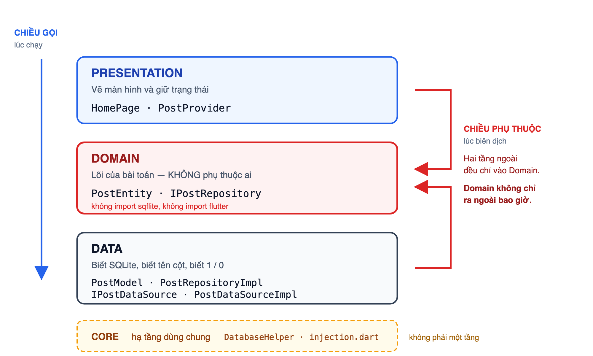

**Thời lượng:** ~90 giây
**Ý chính:** đưa cho lớp **tấm bản đồ** trước khi đi vào từng con đường nhỏ. Và
quan trọng nhất: cho thấy có **hai chiều mũi tên khác nhau**, đừng lẫn lộn.

> Slide này không có code. Đừng vội. Cả phần còn lại của bài chỉ là đi lại tấm
> bản đồ này một cách chậm rãi.

### Lời nói

> *"Trước khi đi vào từng bước, em xin đưa cho các bạn một tấm bản đồ, để lát
> nữa em nói tới đâu các bạn biết mình đang đứng ở đâu.*
>
> *Kiến trúc trong Lab 5 chia code thành **ba tầng**.*
>
> *Trên cùng là **Presentation** — tầng giao diện. Gồm `HomePage` và
> `PostProvider`. Tầng này chỉ làm hai việc: vẽ màn hình, và giữ trạng thái. Nó
> **không hề biết** dữ liệu đến từ đâu.*
>
> *Ở giữa là **Domain** — em gọi là lõi của bài toán. Gồm `PostEntity` và
> `IPostRepository`. Đây là tầng đặc biệt nhất: nó **không phụ thuộc vào bất cứ
> thứ gì**. Các bạn mở hai file này ra sẽ thấy không có một dòng `import sqflite`
> nào, thậm chí không `import flutter`. Nó chỉ mô tả: bài này có khái niệm 'Post',
> và có một hợp đồng tên `IPostRepository`.*
>
> *Dưới cùng là **Data** — tầng biết chuyện bẩn. Gồm `PostModel`,
> `PostRepositoryImpl`, `IPostDataSource` và `PostDataSourceImpl`. Chỉ tầng này
> mới biết đang dùng SQLite, biết tên cột trong bảng, biết SQLite không có kiểu
> boolean nên phải lưu 1 với 0.*
>
> *Còn cái khung nét đứt màu vàng ở dưới — **Core** — em xin nói rõ: nó **không
> phải tầng thứ tư**. Nó là hạ tầng dùng chung: `DatabaseHelper` mở database, và
> `injection.dart` là chỗ lắp ráp. Em tách riêng để khỏi nhét bừa vào tầng nào.*
>
> *Và bây giờ là chỗ quan trọng nhất của slide này. Các bạn nhìn hai cột mũi tên
> hai bên — **chúng chỉ hai hướng ngược nhau, và đó không phải lỗi vẽ**.*
>
> *Mũi tên xanh bên trái là **chiều gọi**, tức là lúc chương trình chạy. Nó đi từ
> trên xuống: giao diện gọi xuống Domain, Domain xuống Data, Data xuống SQLite.
> Cái này thì ai cũng đoán được.*
>
> *Nhưng mũi tên đỏ bên phải là **chiều phụ thuộc**, tức là lúc biên dịch — code
> nào phải biết tới code nào. Và các bạn thấy đấy: cả tầng trên lẫn tầng dưới
> **đều chỉ vào Domain ở giữa**. Còn Domain thì **không chỉ ra ngoài bao giờ**.*
>
> *Nói cách khác: Presentation biết `IPostRepository`. Data cũng biết
> `IPostRepository`. Nhưng `IPostRepository` thì không biết ai hết.*
>
> *Đó chính xác là lý do vì sao đổi database mà tầng giao diện không phải sửa.
> Toàn bộ phần còn lại của bài em chỉ đang chứng minh câu vừa rồi thôi ạ."*

### Chỉ vào đâu

1. Chỉ lần lượt **ba ô** khi đọc tên ba tầng — chậm, mỗi ô một nhịp
2. Khi nói "không import sqflite", **gõ nhẹ vào dòng chữ đỏ nhỏ** trong ô Domain
3. Chỉ khung **nét đứt** khi nói "Core không phải tầng thứ tư"
4. **Vuốt tay từ trên xuống dọc mũi tên xanh** khi nói "chiều gọi"
5. **Dừng hẳn lại**, rồi chỉ hai mũi tên đỏ, đưa tay từ ngoài vào giữa **hai lần**
   — một lần từ trên, một lần từ dưới — khi nói "đều chỉ vào Domain"

> Động tác số 5 là động tác đáng giá nhất cả bài. Tập trước ở nhà.

### Nếu bị hỏi

**"Sao phải chia làm ba tầng cho phức tạp? Viết một file cũng chạy mà."**
→ *"Dạ đúng là một file vẫn chạy. Chia tầng không làm app chạy nhanh hơn, nó làm
**thay đổi** rẻ hơn. Bài này nhỏ nên chưa thấy rõ, nhưng đúng ba slide nữa em sẽ
cho thấy đổi cả database mà chỉ sửa một dòng — đó là thứ một-file không làm
được."*

**"Hai mũi tên ngược nhau, rốt cuộc cái nào đúng?"**
→ *"Dạ cả hai đều đúng, vì chúng nói hai chuyện khác nhau ạ. Xanh là **lúc chạy**
— ai gọi ai. Đỏ là **lúc biên dịch** — ai phải import ai. Điều khiển thì đi
xuống, nhưng phụ thuộc thì đi vào trong. Đảo ngược được như vậy là nhờ
interface."*

**"Core có phải là một tầng không?"**
→ *"Dạ không ạ. Nó là hạ tầng dùng chung — `DatabaseHelper` và chỗ lắp ráp
`injection.dart`. Em để nét đứt trên sơ đồ chính là để phân biệt với ba tầng
thật."*

**"Entity với Model khác gì nhau?"**
→ *"Dạ hai slide nữa em sẽ nói kỹ. Nói ngắn: `PostEntity` là cách app hiểu dữ
liệu, `PostModel` là cách database lưu dữ liệu. Ví dụ `isLike` — trong Entity là
`true`/`false`, trong Model là `1`/`0`, vì SQLite không có kiểu boolean."*

---
---

# Slide 6 — Flow 1: Tạo hợp đồng trước

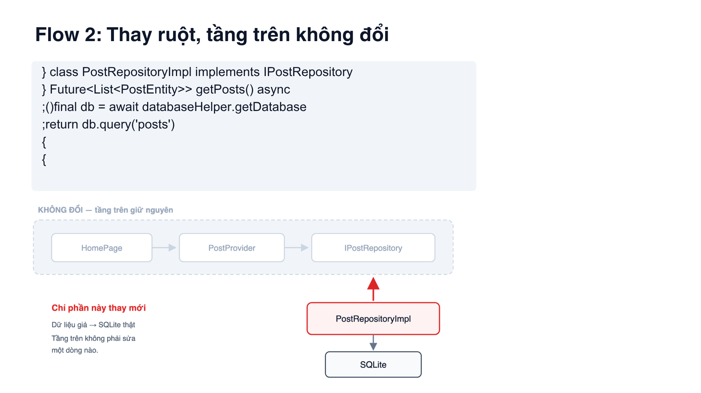

**Thời lượng:** ~100 giây
**Ý chính:** viết ra **lời hứa** trước, chưa cần biết ai thực hiện.

### Lời nói

> *"Bây giờ mình bắt đầu từ Flow 1 — bước đầu tiên trong năm bước của Lab 5.*
>
> *Ở bước này, app chưa có database gì cả. Việc đầu tiên thầy cho làm không phải
> là viết code lấy dữ liệu, mà là viết ra một **bản hợp đồng**.*
>
> *Các bạn nhìn đoạn code này: `abstract class IPostRepository`, bên trong có
> một dòng `getPosts()`. Chỉ có vậy. Nó **khai báo** là sẽ có một việc tên
> `getPosts` trả về danh sách Post — nhưng **không viết làm thế nào**. Không có
> thân hàm, không có gì cả.*
>
> *Cái này giống hệt `interface` trong Java mà mình đã học.*
>
> *Em lấy một ví dụ dễ hình dung. Khi công ty tuyển người, người ta không tuyển
> đích danh 'anh Nam'. Người ta viết một **bản mô tả công việc**: cần người làm
> được việc A, việc B, việc C. Ai đáp ứng thì vào làm.*
>
> *`IPostRepository` chính là bản mô tả công việc đó.*
>
> *Và ở dưới đây là `InMemoryPostRepository` — tạm hiểu là 'anh Nam' đầu tiên.
> Ở Flow 1 anh này chưa làm gì ghê gớm, chỉ trả về mấy dữ liệu giả để app chạy
> được.*
>
> *Các bạn để ý mũi tên màu đỏ này — nó **đi ngược lên**. `PostProvider` không
> gọi xuống `InMemoryPostRepository`. Mà ngược lại, `InMemoryPostRepository` tự
> **cắm ngược lên** bản hợp đồng. Chi tiết nhỏ này chính là chìa khoá của cả Lab
> 5, lát nữa em sẽ quay lại."*

### Chỉ vào đâu
1. Chỉ vào đoạn code khi nói "abstract class"
2. Chỉ vào ô `IPostRepository` màu đỏ khi nói "bản mô tả công việc"
3. **Chỉ vào mũi tên đỏ** và giữ tay ở đó vài giây khi nói "đi ngược lên"

### Nếu bị hỏi
**"Khai báo mà không làm gì thì có tác dụng gì?"**
→ *"Tác dụng là cho phép tầng trên phụ thuộc vào **lời hứa** thay vì phụ thuộc
vào **người thực hiện**. `PostProvider` chỉ cần biết có ai đó hứa trả về danh
sách Post. Ai hứa, hứa bằng SQLite hay bằng API — nó không cần biết. Giống phòng
ban chỉ cần việc được làm, không quan tâm là anh Nam hay anh Bình."*

**"Chữ I ở đầu tên nghĩa là gì?"**
→ *"I là Interface ạ. Đây là quy ước đặt tên, nhìn vào là biết ngay đây là hợp
đồng chứ không phải class làm việc thật."*

---
---

# Slide 7 — Flow 2: Thay ruột, tầng trên không đổi


**Thời lượng:** ~100 giây
**Ý chính:** thay dữ liệu giả bằng database thật, mà **tầng trên không sửa gì**.
Đây là lần đầu lớp **nhìn thấy** lợi ích.

### Lời nói

> *"Sang Flow 2. Bây giờ mình vứt dữ liệu giả đi, thay bằng SQLite thật.*
>
> *Nhóm em viết một class mới tên `PostRepositoryImpl`. Chữ `implements
> IPostRepository` ở đây nghĩa là: class này **cam kết thực hiện đúng bản hợp
> đồng** vừa nãy. Bên trong nó mở database và chạy câu lệnh query để lấy dữ liệu
> thật.*
>
> *Quay lại ví dụ tuyển dụng: anh Nam nghỉ việc, công ty tuyển anh Bình vào thay.
> Anh Bình làm việc theo cách khác, giỏi hơn — nhưng vẫn đúng bản mô tả công việc
> cũ.*
>
> *Và đây là điều em muốn các bạn để ý nhất ở slide này.*
>
> *Các bạn nhìn cái khung xám phía dưới — trong đó có `HomePage`, `PostProvider`
> và `IPostRepository`. Em đã cố tình tô mờ chúng đi, và ghi rõ: **KHÔNG ĐỔI**.*
>
> *Nghĩa là: mình vừa đổi từ dữ liệu giả sang database thật — một thay đổi rất
> lớn — nhưng màn hình và phần quản lý trạng thái **không phải sửa một dòng nào**.*
>
> *Chỉ có đúng phần màu đỏ ở dưới là mới. Đó là lợi ích đầu tiên mà mình nhìn
> thấy được bằng mắt."*

### Chỉ vào đâu
1. Chỉ vào chữ `implements` trong code
2. **Quét cả bàn tay ngang khung xám** khi nói "KHÔNG ĐỔI" — động tác này rất
   hiệu quả
3. Chỉ vào ô đỏ `PostRepositoryImpl` khi nói "chỉ phần này là mới"

### Nếu bị hỏi
**"Vậy `InMemoryPostRepository` ở Flow 1 vứt đi à?"**
→ *"Không ạ, nó vẫn còn. Thực tế cuối bài nhóm em có dùng lại ý tưởng đó để làm
một cải tiến — lát bạn Tuấn sẽ cho thấy."*

---
---

# Slide 8 — Flow 3: PostModel làm người phiên dịch

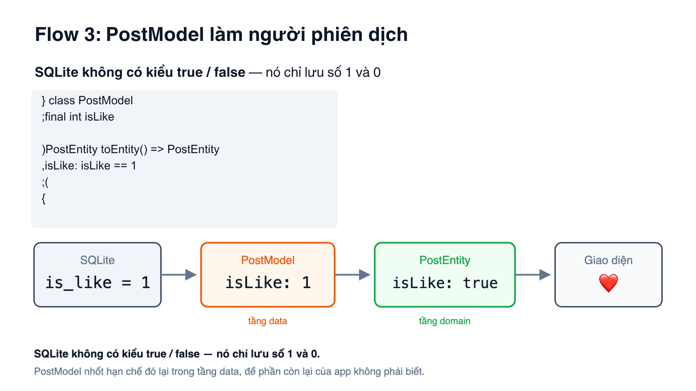

**Thời lượng:** ~130 giây
**Ý chính:** SQLite không có `true`/`false`, nên cần một lớp **phiên dịch** để
hạn chế của database không lan ra cả app.

> Đây là slide **khó hiểu nhất** với người nghe. Nói chậm.

### Lời nói

> *"Flow 3 giải quyết một vấn đề nhỏ nhưng rất khó chịu.*
>
> *Trong app của nhóm em, mỗi bài Post có một nút trái tim — thích hoặc không
> thích. Trong đầu lập trình viên, cái đó là đúng hoặc sai — `true` hoặc `false`.*
>
> *Nhưng **SQLite không có kiểu `true` / `false`**. Nó chỉ có năm kiểu dữ liệu,
> và không kiểu nào là boolean cả. Muốn lưu đúng-sai thì phải quy ước bằng số:
> **1 là đã thích, 0 là chưa**.*
>
> *Vậy vấn đề là gì? Nếu mình để con số 1 và 0 đó chạy thẳng lên tới màn hình,
> thì mọi chỗ trong app đều phải nhớ cái quy ước 'một nghĩa là đã thích'. Một hạn
> chế của database bỗng nhiên lan ra toàn bộ chương trình.*
>
> *Nên nhóm em làm thế này — các bạn nhìn sơ đồ bốn ô ở dưới.*
>
> *Ô đầu là SQLite, nó lưu `is_like = 1`.*
>
> *Ô thứ hai là `PostModel` — đây là **người phiên dịch**. Nó vẫn giữ số 1, vì nó
> thuộc tầng data, nó **được phép** biết chuyện của database.*
>
> *Ô thứ ba là `PostEntity`. Đây mới là thứ mà phần còn lại của app dùng. Và ở
> đây nó đã thành `true` rồi — sạch sẽ, đúng kiểu mà lập trình viên muốn.*
>
> *Ô cuối là giao diện, hiện ra trái tim màu đỏ.*
>
> *Nói ngắn gọn: `PostModel` **nhốt cái xấu xí của database lại trong tầng data**,
> để `PostEntity` và phần còn lại của app không phải biết."*

### Chỉ vào đâu
Đi lần lượt từng ô trong sơ đồ bốn ô, **dừng ở mỗi ô khoảng 2 giây**. Đây là
slide mà việc chỉ tay theo thứ tự giúp người nghe theo kịp rất nhiều.

### Nếu bị hỏi
**"Hai class giống nhau gần hết, sao không gộp làm một?"**
→ *"Vì nếu gộp thì cả app phải viết `isLike == 1`. Và tới ngày mình đổi sang gọi
API — nơi mà JSON trả về `true`/`false` thật — thì phải sửa khắp nơi. Còn tách ra
thì chỗ duy nhất phải sửa là `PostModel`."*

**"SQLite có mấy kiểu dữ liệu?"**
→ *"Năm kiểu ạ: NULL, INTEGER, REAL, TEXT và BLOB. Không có boolean."*

---
---

# Slide 9 — Ai nối các mảnh?

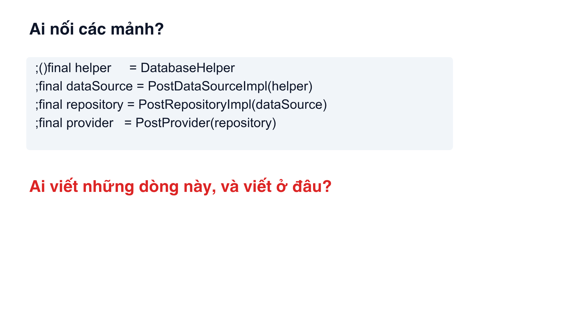

**Thời lượng:** ~60 giây
**Ý chính:** đặt ra vấn đề mới — tách rồi thì **ai ghép lại**?

### Lời nói

> *"Đến đây mình đã có mấy tầng tách bạch rồi. Nhưng nảy sinh một vấn đề mới.*
>
> *Các bạn nhìn bốn dòng code này. Cuối cùng vẫn phải có ai đó viết ra chúng —
> tạo `DatabaseHelper`, rồi lấy nó đưa vào `PostDataSourceImpl`, rồi lấy cái đó
> đưa vào `PostRepositoryImpl`, rồi cuối cùng đưa vào `PostProvider`. Nối từng
> cái một.*
>
> *Câu hỏi là: **ai viết những dòng này, và viết ở đâu?***
>
> *Nếu mình viết chúng ngay trong màn hình, thì hỏng hết. Vì lúc đó màn hình lại
> biết hết mọi tầng bên dưới — biết có `DatabaseHelper`, biết có
> `PostDataSourceImpl`. Công sức tách ra nãy giờ thành vô nghĩa.*
>
> *Vậy phải có một nơi biết hết mọi tầng, nhưng **bản thân nó không nằm trong
> tầng nào**. Nơi đó là gì, em xin nói ở slide sau."*

> **Câu cuối là bắt buộc.** Không có nó, lớp sẽ tưởng bạn quên trả lời. Có nó,
> câu hỏi thành "cố tình treo" — và slide sau gỡ.

### Chỉ vào đâu
Chỉ lần lượt bốn dòng code, cho thấy nó **xâu chuỗi vào nhau** — cái sau dùng
cái trước.

### Nếu bị hỏi
**"Sao không để mỗi class tự tạo cái nó cần?"**
→ *"Nếu `PostProvider` tự tạo `PostRepositoryImpl` bên trong nó, thì nó lại trói
mình vào class cụ thể đó rồi ạ. Lúc đó muốn đổi sang class khác là phải sửa
`PostProvider`. Đúng cái mình đang cố tránh."*

---
---

# Slide 10 — Flow 4: GetIt

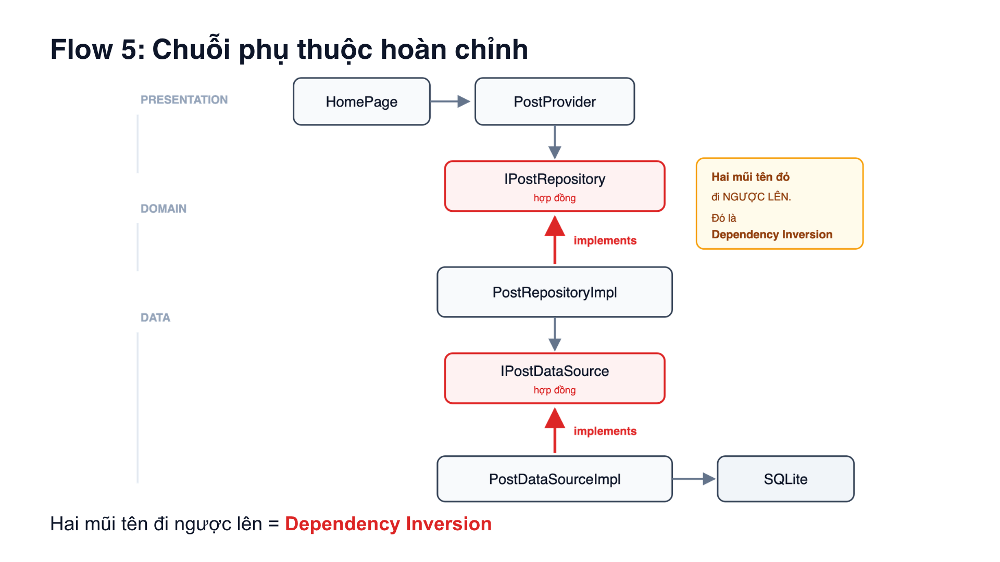

**Thời lượng:** ~100 giây
**Ý chính:** GetIt là **phòng nhân sự** — nơi duy nhất biết ai ngồi vị trí nào.

### Lời nói

> *"Flow 4 trả lời câu hỏi vừa rồi bằng một thư viện tên **GetIt**.*
>
> *Ý tưởng rất đơn giản: gom toàn bộ việc lắp ráp đó về **một file duy nhất**, tên
> là `injection.dart`.*
>
> *Các bạn đọc dòng này: `registerLazySingleton<IPostRepository>` rồi bên trong
> là `PostRepositoryImpl`. Dịch ra tiếng Việt nó có nghĩa là: **'khi nào có ai
> hỏi xin IPostRepository, thì đưa cho họ PostRepositoryImpl'**.*
>
> *Quay lại ví dụ công ty: đây chính là **phòng nhân sự**. Phòng nhân sự là nơi
> duy nhất biết vị trí này đang do anh Nam hay anh Bình đảm nhiệm. Các phòng ban
> khác không cần biết — họ chỉ cần gọi 'cho tôi người phụ trách việc này'.*
>
> *Và em muốn nhấn mạnh: **GetIt không phải để đỡ phải gõ chữ `new`**. Nhiều bạn
> hiểu nhầm chỗ này. Giá trị thật của nó là **tách nơi quyết định dùng cái gì ra
> khỏi nơi sử dụng nó**.*
>
> *Một chi tiết nữa: hàm `setDI` này **chưa tạo ra object nào cả**. Nó chỉ ghi
> lại công thức thôi. Object thật chỉ được tạo khi có ai đó hỏi tới. Đó là ý
> nghĩa của chữ **Lazy** — lười, khi nào cần mới làm.*
>
> *Còn `Factory` ở dòng dưới thì ngược lại: mỗi lần hỏi là tạo một cái mới."*

### Chỉ vào đâu
1. Chỉ `registerLazySingleton<IPostRepository>` khi đọc "khi nào có ai hỏi xin"
2. Chỉ `PostRepositoryImpl` khi nói "thì đưa cho họ"
3. Chỉ dòng chữ dưới cùng khi phân biệt Lazy vs Factory

### Nếu bị hỏi
**"`LazySingleton` khác `Factory` chỗ nào?"**
→ *"`LazySingleton` tạo **một lần duy nhất**, lần đầu có người hỏi tới, rồi dùng
lại mãi. Còn `Factory` thì **tạo mới mỗi lần** được hỏi."*

**"Sao `PostProvider` lại dùng Factory?"**
→ *"Vì Provider giữ trạng thái của màn hình. Nếu để singleton thì mở lại màn
hình sẽ thấy trạng thái cũ còn nguyên. Factory đảm bảo mỗi lần vào màn hình là
một trạng thái sạch."*

**"Không dùng GetIt có được không?"**
→ *"Được ạ, vẫn chạy. Nhưng đống code lắp ráp đó phải nằm ở đâu đó — và chỗ đó
lại biết hết mọi tầng. GetIt gom nó về một file riêng để không chỗ nào khác phải
biết."*

---
---

# Slide 11 — Flow 5: Chuỗi phụ thuộc hoàn chỉnh


**Thời lượng:** ~140 giây
**Ý chính:** đây là **bức tranh hoàn chỉnh**. Hai mũi tên đỏ là điều duy nhất
cần nhớ.

> Slide trung tâm của cả bài. Đừng vội.

### Lời nói

> *"Đây là bức tranh hoàn chỉnh sau khi đi hết năm bước.*
>
> *Bên trái là ba tầng: **Presentation** ở trên — là màn hình và phần quản lý
> trạng thái. **Domain** ở giữa — là phần lõi. **Data** ở dưới — là phần đụng tới
> database.*
>
> *Mình đi từ trên xuống. `HomePage` là màn hình, nó nói chuyện với
> `PostProvider`. `PostProvider` gọi xuống `IPostRepository` — bản hợp đồng.*
>
> *Rồi đây, mũi tên đỏ thứ nhất: `PostRepositoryImpl` **cắm ngược lên** hợp đồng
> đó.*
>
> *Ở Flow 5, thầy cho tách thêm một lần nữa — và đây là chỗ **`IPostDataSource`
> lần đầu xuất hiện**, nên em xin dừng lại giải thích.*
>
> *Ở bốn bước trước, `PostRepositoryImpl` làm hai việc cùng lúc: vừa **chạy câu
> lệnh SQL để lấy dữ liệu**, vừa **dịch dữ liệu đó sang `PostEntity`**. Hai việc
> đó thay đổi vì hai lý do khác nhau — việc đầu đổi khi mình đổi nơi chứa dữ
> liệu, việc sau đổi khi mình đổi cách app hiểu dữ liệu.*
>
> *Flow 5 tách đôi chúng ra. Phần chạy SQL đi xuống `PostDataSourceImpl`. Phần
> dịch ở lại `PostRepositoryImpl`. Và giữa hai cái là hợp đồng thứ hai:
> `IPostDataSource`. Lại có mũi tên đỏ thứ hai — `PostDataSourceImpl` cắm ngược
> lên nó.*
>
> *Nói ngắn gọn: **Data Source biết lấy dữ liệu ở đâu. Repository biết dịch nó
> thành gì.***
>
> *Cái này đổi được một chuyện rất lớn: từ giờ **`PostRepositoryImpl` không còn
> biết SQLite tồn tại nữa** — mở file ra sẽ thấy nó không import `DatabaseHelper`
> nữa. Lát nữa các bạn sẽ thấy vì sao điều đó quan trọng.*
>
> *Cuối cùng mới tới SQLite.*
>
> *Bây giờ em muốn các bạn để ý một điều. Mọi mũi tên xám đều đi **xuống** —
> tầng trên nhờ tầng dưới làm việc, chuyện đó bình thường.*
>
> *Nhưng **hai mũi tên đỏ này đi ngược lên**. Và hiện tượng đó có tên riêng:
> **Dependency Inversion** — đảo ngược phụ thuộc.*
>
> *Nó nghĩa là gì? Nghĩa là `PostRepositoryImpl` không được ai gọi tên trực tiếp
> cả. Nó tự nguyện đứng vào đúng vị trí mà hợp đồng mô tả. Giống anh Bình tự
> nguyện đáp ứng bản mô tả công việc, chứ phòng ban không đi tìm đích danh anh
> Bình."*

### Chỉ vào đâu
1. Chỉ ba nhãn `PRESENTATION` / `DOMAIN` / `DATA` bên trái trước
2. Đi từ trên xuống theo đúng thứ tự các ô
3. **Dừng hẳn lại ở hai mũi tên đỏ**, chỉ vào từng cái một

### Nếu bị hỏi
**"Sao cần tới hai hợp đồng, một cái không đủ à?"**
→ *"Với bài này thì đúng là một cái cũng chạy được ạ. Giá trị thật lộ ra khi app
có nhiều nguồn dữ liệu — ví dụ vừa có SQLite vừa có API. Lúc đó Repository là
chỗ quyết định lấy nguồn nào, mất mạng thì dùng cache. Còn Data Source thì mỗi
cái chỉ biết đúng nguồn của nó."*

**"Data Source khác Repository chỗ nào?"**
→ *"Data Source biết **lấy dữ liệu ở đâu và bằng cách nào** — nó biết SQL, biết
tên cột. Repository biết **app cần gì** — nó nhận dữ liệu thô rồi dịch sang
Entity sạch cho tầng trên dùng."*

---
---

# Slide 12 — Một dòng.

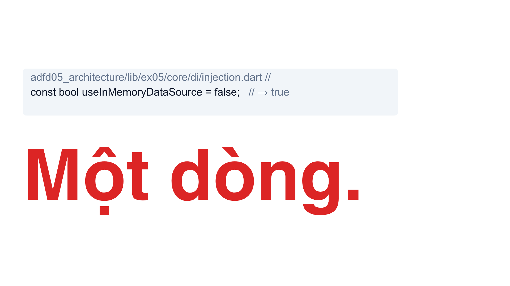

**Thời lượng:** ~70 giây
**Ý chính:** **trả câu hỏi đã gieo ở slide 4**. Đây là cao trào.

### Lời nói

> *"Bây giờ mình quay lại câu hỏi em đặt ra ở đầu buổi.*
>
> *Em đã hỏi: nếu ngày mai phải đổi nguồn dữ liệu, thì phải sửa bao nhiêu file?*
>
> *Các bạn còn nhớ con số mình nghĩ trong đầu không?"*

**→ DỪNG. Nhìn xuống lớp. Đếm thầm hai giây.**

> *"Câu trả lời là..."*

**→ Bấm chuyển hiệu ứng hoặc chỉ tay vào dòng chữ đỏ.**

> *"**Một dòng.** Trong đúng một file.*
>
> *Đây, dòng này — `const bool useInMemoryDataSource = false`. Đổi `false` thành
> `true`. Chỉ vậy thôi."*

### Chỉ vào đâu
Chỉ vào chữ `false` trong đoạn code, rồi chỉ sang dòng chữ đỏ khổng lồ.

### Lưu ý về nhịp
Slide này **sống hay chết là ở khoảng lặng**. Nếu bạn nói liền một mạch "câu trả
lời là một dòng" thì mất hết. Phải **dừng lại**, để lớp kịp nhớ lại câu hỏi cũ.

### Nếu bị hỏi
**"Thật sự chỉ một dòng thôi à?"**
→ *"Dạ đúng một dòng. Slide sau em có ảnh chụp màn hình thật để chứng minh."*

---
---

# Slide 13 — Bằng chứng

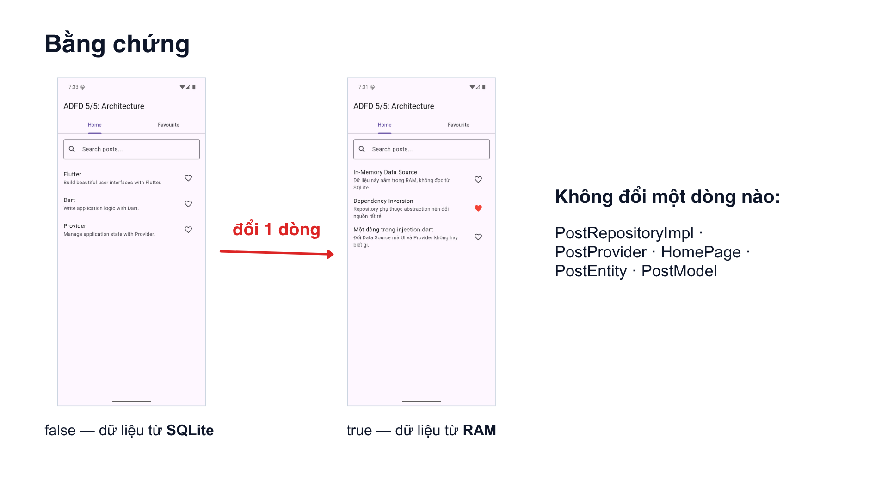

**Thời lượng:** ~60 giây
**Ý chính:** **chứng minh** bằng ảnh thật, không nói suông.

### Lời nói

> *"Và đây là bằng chứng. Hai ảnh này nhóm em chụp từ máy ảo thật.*
>
> *Bên trái: công tắc để `false`, dữ liệu lấy từ **SQLite**. Các bạn thấy ba bài
> Post là Flutter, Dart và Provider.*
>
> *Bên phải: đổi đúng một dòng thành `true`, chạy lại. Dữ liệu giờ lấy từ **RAM**
> — hoàn toàn không đụng tới database nữa. Nội dung ba bài Post đã khác.*
>
> *Nhưng các bạn để ý: **giao diện y hệt nhau**. Vẫn hai tab Home và Favourite.
> Vẫn ô tìm kiếm. Vẫn nút trái tim. Mọi chức năng đều chạy — đọc, thích, tìm
> kiếm.*
>
> *Và đặc biệt các bạn nhìn cái trái tim đỏ ở ảnh bên phải nhé. Nó chứng minh
> phần phiên dịch từ Model sang Entity mà em nói ở Flow 3 **vẫn hoạt động nguyên
> vẹn** qua nguồn dữ liệu mới.*
>
> *Bên phải đây là danh sách những file **không phải sửa một dòng nào**:
> `PostRepositoryImpl`, `PostProvider`, `HomePage`, `PostEntity`, `PostModel`.*
>
> *Vì sao chúng không phải sửa? Vì tất cả chúng chỉ phụ thuộc vào **hợp đồng**,
> không phụ thuộc vào class cụ thể. Đúng như hai mũi tên đỏ ở slide trước.*
>
> *Đó là toàn bộ giá trị của kiến trúc trong Lab 5. Em xin hết phần của em."*

### Chỉ vào đâu
1. Chỉ ảnh trái, đọc tên ba Post
2. Chỉ ảnh phải, đọc tên ba Post mới
3. **Chỉ vào trái tim đỏ** — chi tiết này ít người để ý, nói ra sẽ gây ấn tượng
4. Chỉ danh sách file bên phải

### Câu chuyển sang Tuấn *(nếu bạn Tuấn trình bày tiếp)*
> *"Phần tiếp theo, bạn Tuấn sẽ nói về Lab 6 — khi dữ liệu không còn nằm trong
> máy mà nằm trên server thật."*

---
---

# ⚠️ LỖI CẦN SỬA GẤP TRƯỚC KHI TRÌNH BÀY

**Code trên slide 6, 7, 8, 9, 10 đang hiển thị SAI thứ tự.**

Dấu ngoặc nhọn đóng `}` bị đẩy lên đầu dòng, dấu chấm phẩy `;` bị đẩy ra trước,
dấu ngoặc đơn bị đảo. Ví dụ slide 10 đang hiện:

```
} ()void setDI
```

Trong khi code thật phải là:

```dart
void setDI() {
```

### Vì sao bị vậy

Đây là lỗi **hiển thị văn bản hai chiều** — công cụ tạo slide nhận nhầm dòng code
là văn bản viết từ phải sang trái, nên nó đẩy các ký tự đặc biệt về sai vị trí.

### Vì sao phải sửa

Thầy dạy lập trình sẽ **nhận ra ngay trong một giây**. Và câu hỏi đầu tiên sẽ là
*"code này viết sai à?"* — mất điểm oan cho một lỗi không phải lỗi code.

### Cách sửa

| Cách | Làm thế nào |
|---|---|
| **Tốt nhất** | Chụp màn hình đoạn code **từ VS Code** rồi chèn ảnh vào slide. Vừa đúng, vừa có tô màu cú pháp, nhìn chuyên nghiệp hơn hẳn |
| Nhanh | Trong Canva, chọn khối code → đổi font sang font thường (không phải monospace) → gõ lại tay từng dòng |
| Tạm được | Bỏ hẳn khối code, chỉ giữ sơ đồ. Slide 6, 7, 8 vẫn hiểu được nhờ sơ đồ |

**Nhóm em nên chọn cách 1.** Code thật lấy từ:

| Slide | File |
|---|---|
| 6 | `adfd05_architecture/lib/ex05/domain/repositories/i_post_repository.dart` |
| 7 | `adfd05_architecture/lib/ex05/data/repositories/post_repository_impl.dart` |
| 8 | `adfd05_architecture/lib/ex05/data/models/post_model.dart` |
| 10 | `adfd05_architecture/lib/ex05/core/di/injection.dart` |

---

# Cách luyện nói

1. **Đọc to toàn bộ kịch bản một lượt.** Đọc thành tiếng, không đọc thầm — miệng
   phải quen với câu chữ.
2. **Lần hai, che phần lời nói đi**, chỉ nhìn slide và ý chính, tự nói lại bằng
   lời của mình. Không cần giống hệt.
3. **Bấm giờ.** Cộng dồn 13 slide là 17 phút 10 — nếu vượt 19 phút thì cắt bớt
   phần "Nếu bị hỏi", đừng cắt mạch chính.
4. **Nhờ người khác hỏi vặn** — dùng phần "Nếu bị hỏi" ở mỗi slide.

> **Điều quan trọng nhất:** đừng học thuộc từng chữ. Học thuộc **ý chính của mỗi
> slide** và **phép so sánh tuyển dụng**. Có hai thứ đó rồi thì bí chỗ nào cũng
> tự nói ra được.
